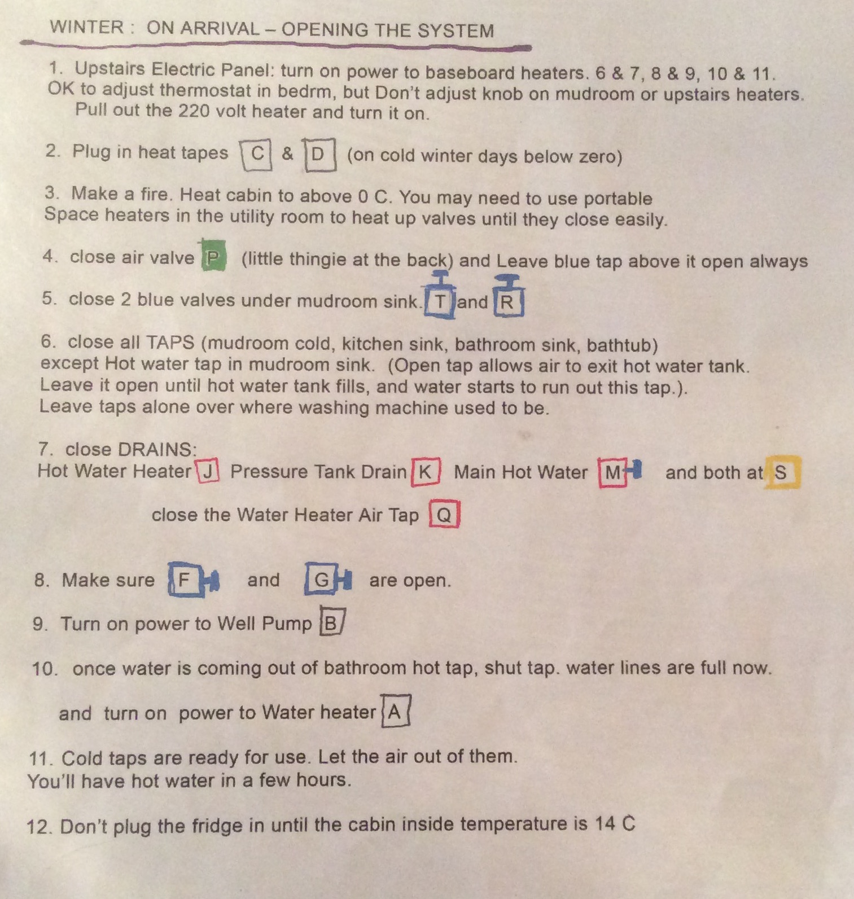

# Winter: On Arrival — Opening the System

* Upstairs Electric Panel: turn on power to baseboard heaters. (6&7, 8&9, 10&11). OK to adjust thermostat in bedrm, but Don’t adjust knob on mudroom or upstairs heaters. Pull out the 220 volt heater and turn it on.
* Plug in heat tapes (C & D - on cold winter days below zero).
* Make a fire. Heat cabin to above 0 C. You may need to use portable space heaters in the utility room to heat up valves until they close easily.
* Close air valve (P - little thingie at the back) and Leave blue tap above it open always
* Close 2 blue valves under mudroom sink. (T & R)
* Close all TAPS (mudroom cold, kitchen sink, bathroom sink, bathtub) except Hot water tap in mudroom sink. (Open tap allows air to exit hot water tank. Leave it open until hot water tank fills, and water starts to run out this tap.). Leave taps alone over where washing machine used to be.
* Close DRAlNS: Hot Water Heater (J), Pressure Tank Drain (K), Main Hot Water (M) and both at (S). Close the Water Heater Air Tap (Q)
* Make sure (F & G) are open.
* Turn on power to Well Pump (B)
* Once water is coming out of bathroom hot tap, shut tap. water lines are full now and turn on power to Water heater (A)
* Cold taps are ready for use. Let the air out of them.  You’ll have hot water in a few hours.
* Don’t plug the fridge in until the cabin inside temperature is 14 C

